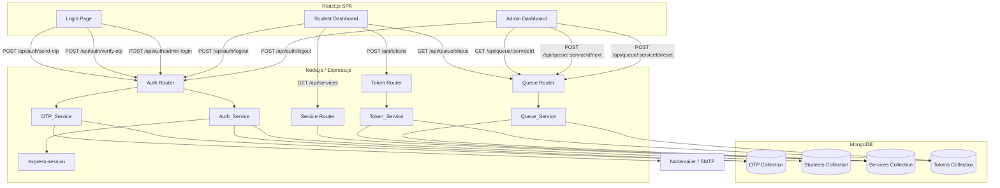
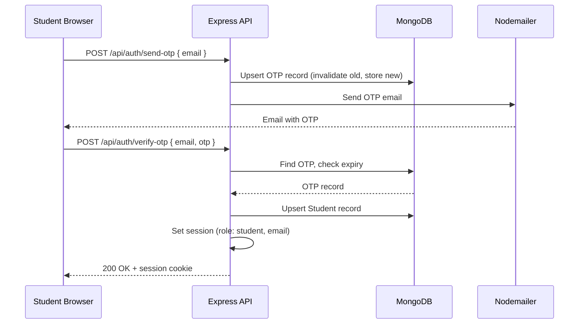

# Design Document: Digital Queue System for College Offices

## Overview

The Digital Queue System replaces physical queues at college administrative offices. Students authenticate via OTP-based email login, select a service, generate a digital token, and track their queue position. Admins manage the queue by advancing tokens and resetting queues per service.

The system is a full-stack web application:
- **Frontend**: React.js with plain CSS, served as a SPA
- **Backend**: Node.js + Express.js REST API
- **Database**: MongoDB via Mongoose
- **Email**: Nodemailer for OTP delivery
- **Sessions**: express-session (server-side, no JWT)

### Key Design Decisions

- **OTP-only student auth**: No passwords for students — reduces friction and avoids credential management.
- **Hardcoded admin credentials via env vars**: Simple, low-overhead admin access for a single-office use case.
- **MongoDB TTL index for OTP cleanup**: Offloads expiry cleanup to the database engine, no cron job needed.
- **FIFO token sequencing per service**: Each service maintains its own incrementing counter, reset-able by admin.
- **Polling for real-time updates**: The student dashboard polls the queue status endpoint every few seconds. This avoids WebSocket complexity for a low-concurrency college office context.

---

## Architecture



### Request Flow — Student Login



---

## Components and Interfaces

### Backend Route Structure

```
POST   /api/auth/send-otp          → OTP_Service.sendOtp(email)
POST   /api/auth/verify-otp        → Auth_Service.verifyOtp(email, otp)
POST   /api/auth/admin-login       → Auth_Service.adminLogin(email, password)
POST   /api/auth/logout            → Auth_Service.logout(session)

GET    /api/services               → Service listing (auth: student)

POST   /api/tokens                 → Token_Service.generateToken(studentEmail, serviceId)
GET    /api/tokens/active          → Token_Service.getActiveToken(studentEmail)

GET    /api/queue/status           → Queue_Service.getStudentStatus(studentEmail)
GET    /api/queue/:serviceId       → Queue_Service.getQueueForService(serviceId) (auth: admin)
POST   /api/queue/:serviceId/next  → Queue_Service.advanceQueue(serviceId) (auth: admin)
POST   /api/queue/:serviceId/reset → Queue_Service.resetQueue(serviceId) (auth: admin)
```

### Middleware

- `requireStudentAuth` — checks `req.session.role === 'student'`, else 401
- `requireAdminAuth` — checks `req.session.role === 'admin'`, else 401

### Frontend Pages / Components

```
LoginPage
  ├── EmailForm        — email input + "Send OTP" button
  └── OtpForm          — OTP input + "Verify" button

StudentDashboard
  ├── ServiceList      — lists services, "Get Token" per service
  ├── TokenStatus      — shows token number, position, ETA, status messages
  └── LogoutButton

AdminDashboard
  ├── ServiceQueuePanel (per service)
  │   ├── TokenTable   — token number, student email, status
  │   ├── NextButton   — "Next Token"
  │   └── ResetButton  — "Reset Queue"
  └── LogoutButton
```

---

## Data Models

### OTP Collection

```js
const otpSchema = new mongoose.Schema({
  email:     { type: String, required: true, index: true },
  otp:       { type: String, required: true },          // hashed or plaintext 6-digit
  expiresAt: { type: Date,   required: true, index: { expireAfterSeconds: 0 } }
});
```

TTL index on `expiresAt` with `expireAfterSeconds: 0` — MongoDB deletes the document when `expiresAt` is reached (satisfies Requirement 8).

### Students Collection

```js
const studentSchema = new mongoose.Schema({
  email:     { type: String, required: true, unique: true },
  createdAt: { type: Date, default: Date.now }
});
```

### Services Collection

```js
const serviceSchema = new mongoose.Schema({
  name:               { type: String, required: true, unique: true },
  avgServiceTimeMin:  { type: Number, required: true, default: 5 },
  currentTokenSeq:    { type: Number, default: 0 }   // last assigned token number
});
```

Seed data: `{ name: "Bonafide", avgServiceTimeMin: 5 }`, `{ name: "ID Card", avgServiceTimeMin: 7 }`, `{ name: "Fees", avgServiceTimeMin: 10 }`.

### Tokens Collection

```js
const tokenSchema = new mongoose.Schema({
  tokenNumber:  { type: Number, required: true },
  studentEmail: { type: String, required: true },
  serviceId:    { type: mongoose.Schema.Types.ObjectId, ref: 'Service', required: true },
  status:       { type: String, enum: ['waiting', 'serving', 'done'], default: 'waiting' },
  createdAt:    { type: Date, default: Date.now }
});

// Compound index for efficient queue queries
tokenSchema.index({ serviceId: 1, status: 1, tokenNumber: 1 });
// Index for active-token lookup per student
tokenSchema.index({ studentEmail: 1, status: 1 });
```

### Token Number Sequencing

Token numbers are managed via `Service.currentTokenSeq`. On token generation:
1. Atomically increment `currentTokenSeq` using `findOneAndUpdate` with `$inc`.
2. Assign the returned new value as `tokenNumber`.

On queue reset:
1. Set all tokens for the service to `status: 'done'`.
2. Set `Service.currentTokenSeq = 0` so the next token starts at 1.

---

## Correctness Properties

*A property is a characteristic or behavior that should hold true across all valid executions of a system — essentially, a formal statement about what the system should do. Properties serve as the bridge between human-readable specifications and machine-verifiable correctness guarantees.*

### Property 1: OTP record created with correct expiry

*For any* valid email address, calling `sendOtp` should result in exactly one OTP record in the OTP Collection for that email, with an `expiresAt` timestamp approximately 10 minutes in the future (within a small tolerance).

**Validates: Requirements 1.1**

---

### Property 2: Invalid email format is rejected

*For any* string that is not a valid email address format, submitting it to the send-OTP endpoint should return an error response containing "Invalid email address" and should not create any OTP record.

**Validates: Requirements 1.3**

---

### Property 3: Correct OTP verifies successfully (round trip)

*For any* valid email, after calling `sendOtp` and then calling `verifyOtp` with the exact OTP that was stored, the response should indicate successful authentication and the session should have `role: 'student'` and the correct email.

**Validates: Requirements 1.4**

---

### Property 4: Wrong OTP is rejected

*For any* email and any OTP string that does not exactly match the stored OTP for that email (including expired/missing records), `verifyOtp` should return an error containing "Invalid or expired OTP" and should not establish a session.

**Validates: Requirements 1.5, 1.6**

---

### Property 5: Re-requesting OTP invalidates the previous one

*For any* email, after calling `sendOtp` twice, the OTP from the first call should be rejected by `verifyOtp` (returning "Invalid or expired OTP"), while the OTP from the second call should succeed.

**Validates: Requirements 1.8**

---

### Property 6: Wrong admin credentials are rejected

*For any* (email, password) pair that does not match the configured admin credentials, the admin login endpoint should return an error containing "Invalid admin credentials" and should not establish an admin session.

**Validates: Requirements 2.3**

---

### Property 7: Access control — wrong role or unauthenticated requests are rejected

*For any* protected route and any request that either has no session or has a session with the wrong role (e.g., a student session hitting an admin-only endpoint), the system should return a 401 Unauthorized response and not process the request.

**Validates: Requirements 2.4, 7.1**

---

### Property 8: Service list response includes all services with required fields

*For any* set of services stored in the Services collection, the `GET /api/services` endpoint should return all of them, and each entry in the response should include `name` and `avgServiceTimeMin`.

**Validates: Requirements 3.2**

---

### Property 9: Token record created with all required fields and correct response

*For any* authenticated student and any valid service, calling `generateToken` should create a Token record with `tokenNumber`, `studentEmail`, `serviceId`, `status: 'waiting'`, and `createdAt`, and the response should include `tokenNumber` and `serviceName`.

**Validates: Requirements 4.1, 4.4**

---

### Property 10: Token numbers are sequential starting from 1

*For any* service, generating N tokens in sequence should produce token numbers 1, 2, 3, ..., N in the order they were created.

**Validates: Requirements 4.2**

---

### Property 11: Duplicate active token is rejected

*For any* student who already has a token with status `'waiting'` or `'serving'` for any service, requesting a new token should return an error containing "You already have an active token" and should not create a new Token record.

**Validates: Requirements 4.3**

---

### Property 12: Queue status response includes all required fields

*For any* authenticated student with an active token, the queue status endpoint should return a response containing `tokenNumber`, `currentlyServingToken`, `tokensAhead`, and `estimatedWaitTimeMin`.

**Validates: Requirements 5.1**

---

### Property 13: ETA calculation is correct

*For any* number of tokens ahead `n` and any service with `avgServiceTimeMin` value `t`, the `estimatedWaitTimeMin` returned by the queue status endpoint should equal `n × t`.

**Validates: Requirements 5.2**

---

### Property 14: Admin queue response includes all token fields

*For any* queue state, the admin queue endpoint `GET /api/queue/:serviceId` should return all tokens for that service, and each token entry should include `tokenNumber`, `studentEmail`, and `status`.

**Validates: Requirements 6.1**

---

### Property 15: Advance queue transitions statuses correctly

*For any* service queue that has at least one token with status `'serving'` and at least one with status `'waiting'`, calling `advanceQueue` should set the previously-serving token to `'done'` and the next waiting token (lowest `tokenNumber`) to `'serving'`.

**Validates: Requirements 6.2**

---

### Property 16: Reset queue sets all tokens to done and resets sequence

*For any* service with any number of tokens in any state, after calling `resetQueue`, all tokens for that service should have status `'done'`, and the next token generated for that service should have `tokenNumber: 1`.

**Validates: Requirements 6.4**

---

### Property 17: Logout invalidates session (round trip)

*For any* active session (student or admin), calling the logout endpoint should destroy the session such that any subsequent request to a protected route using the same session cookie returns 401.

**Validates: Requirements 7.4**

---

## Error Handling

### Validation Errors (400)
- Invalid email format → `{ error: "Invalid email address" }`
- Empty required fields → `{ error: "Missing required fields" }`
- Student already has active token → `{ error: "You already have an active token" }`
- No waiting tokens when advancing → `{ message: "No more tokens in queue" }`

### Authentication Errors (401)
- Wrong OTP or expired → `{ error: "Invalid or expired OTP" }`
- Wrong admin credentials → `{ error: "Invalid admin credentials" }`
- Unauthenticated access to protected route → `{ error: "Unauthorized" }`
- Wrong role (student hitting admin route) → `{ error: "Forbidden" }` (403)

### Not Found (404)
- Service ID not found → `{ error: "Service not found" }`
- No active token for student → `{ error: "No active token found" }`

### Server Errors (500)
- Nodemailer failure → log error, return `{ error: "Failed to send OTP. Please try again." }`
- MongoDB operation failure → log error, return `{ error: "Internal server error" }`

### Frontend Error Handling
- All API errors are caught and displayed inline near the relevant form/action.
- Network errors show a generic "Something went wrong. Please try again." message.
- The student dashboard polling (queue status) silently retries on transient errors without showing an error to the user unless 3 consecutive failures occur.

---

## Testing Strategy

### Dual Testing Approach

Both unit tests and property-based tests are required. They are complementary:
- **Unit tests** cover specific examples, integration points, and edge cases.
- **Property-based tests** verify universal correctness across randomized inputs.

### Property-Based Testing

**Library**: [fast-check](https://github.com/dubzzz/fast-check) (JavaScript/Node.js)

Each property-based test must:
- Run a minimum of **100 iterations** (fast-check default is 100; set explicitly via `{ numRuns: 100 }`)
- Include a comment tag referencing the design property:
  `// Feature: digital-queue-system, Property N: <property_text>`
- Be implemented as a **single** `fc.assert(fc.asyncProperty(...))` per design property

**Properties to implement as PBT tests:**

| Property | Test Description |
|---|---|
| P1 | Generate random valid emails → verify OTP record exists with correct expiry |
| P2 | Generate random non-email strings → verify 400 + error message |
| P3 | Generate random emails → sendOtp then verifyOtp with stored OTP → session established |
| P4 | Generate random emails + wrong OTP strings → verify rejection |
| P5 | Generate random emails → sendOtp twice → first OTP rejected, second accepted |
| P6 | Generate random (email, password) pairs ≠ admin creds → verify rejection |
| P7 | Generate random routes + wrong-role sessions → verify 401 |
| P8 | Generate random service sets → verify all returned with required fields |
| P9 | Generate random (student, service) pairs → verify token record fields + response fields |
| P10 | Generate N random token requests for same service → verify sequential numbering |
| P11 | Generate student with active token → request another → verify rejection |
| P12 | Generate random queue states → verify status response has all required fields |
| P13 | Generate random (n, t) pairs → verify ETA = n × t |
| P14 | Generate random queue states → verify admin response has all token fields |
| P15 | Generate random queues with serving + waiting tokens → advance → verify transitions |
| P16 | Generate random queue states → reset → verify all done + next token is 1 |
| P17 | Generate random sessions → logout → verify subsequent protected request returns 401 |

### Unit Tests

Unit tests focus on:
- **Seed data**: Verify "Bonafide", "ID Card", "Fees" services exist after seeding (Req 3.1)
- **Admin login success**: Correct credentials → admin session established (Req 2.2)
- **Status messages**: Token status `'serving'` → "It's your turn now"; `'done'` → "Your token has been completed"; `tokensAhead <= 1` → "Your turn is near" (Req 5.3, 5.5, 5.6)
- **Empty queue advance**: No waiting tokens → "No more tokens in queue" (Req 6.3)
- **Post-login redirect**: Student → Student_Dashboard; Admin → Admin_Dashboard (Req 7.2, 7.3)
- **TTL index schema**: Verify `expiresAt` field has `expireAfterSeconds: 0` index defined (Req 8.1)
- **Queue reset UI**: After reset, admin queue shows empty list (Req 6.5)

### Test File Structure

```
tests/
  unit/
    auth.test.js          — admin login, OTP send/verify examples
    token.test.js         — seed data, status messages, edge cases
    queue.test.js         — empty queue advance, reset UI
    schema.test.js        — TTL index verification
  property/
    auth.property.test.js — P1–P5, P17
    admin.property.test.js — P6–P7
    service.property.test.js — P8
    token.property.test.js — P9–P11
    queue.property.test.js — P12–P16
```

**Test runner**: Jest (`jest --testPathPattern=tests/`)
Run once (no watch mode): `jest --runInBand --forceExit`
