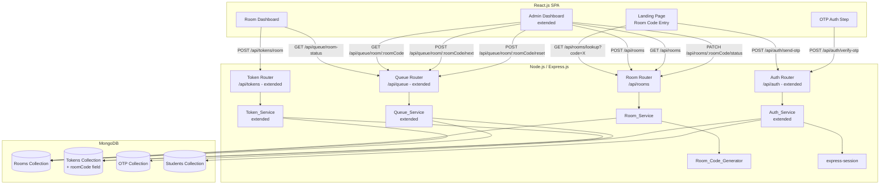
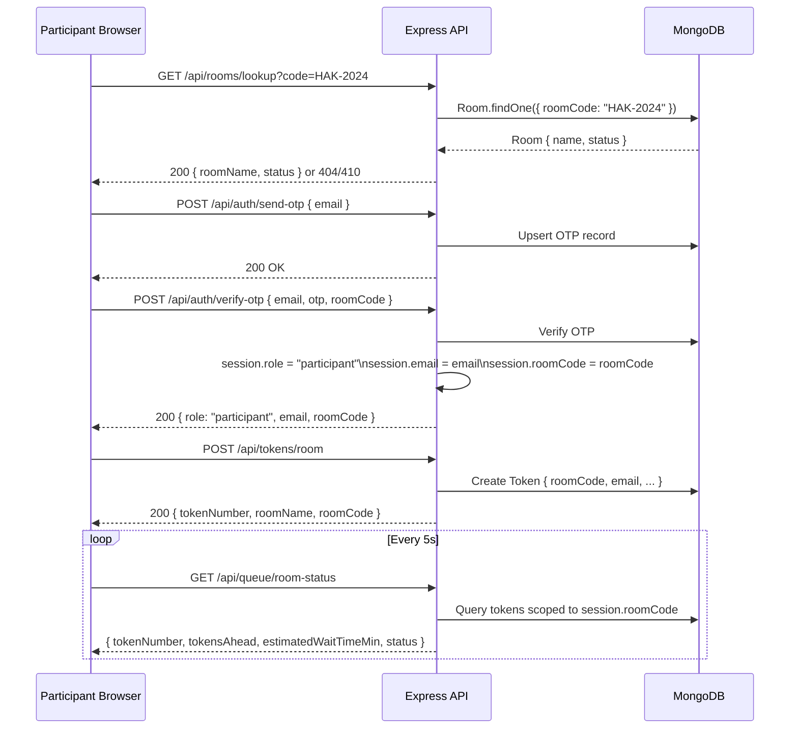

# Design Document: Room Code Queue

## Overview

The Room Code Queue feature extends the existing Digital Queue System with private, room-scoped access. An admin creates a Room (a named queue instance) and receives a short human-readable Room Code (e.g. `HAK-2024`, `PITCH-7X3`). Participants enter the code on the landing page, authenticate via OTP, and are scoped exclusively to that room's queue.

The feature is additive — existing admin auth, session management, and the `GET /api/services` endpoint are preserved unchanged.

### Key Design Decisions

- **Room extends Service, not replaces it**: A new `Room` model is introduced that embeds the same fields as `Service` (`name`, `avgServiceTimeMin`, `currentTokenSeq`) plus `roomCode` and `status`. Existing `Service` documents and routes are untouched, satisfying backward compatibility (Req 9).
- **Room Code stored in session**: After a participant validates a room code, it is stored in `req.session.roomCode`. All subsequent participant requests read the room code from the session — no need to pass it in every request body.
- **Token model gains a `roomCode` field**: This allows efficient scoped queries without joining through Room on every request.
- **Participant role replaces student role for room-scoped flows**: `session.role = 'participant'` distinguishes room-scoped users from the legacy `'student'` role. Existing `requireStudentAuth` middleware is unchanged; a new `requireParticipantAuth` middleware is added.
- **Room Code generation**: A deterministic word-list approach produces `WORD-SUFFIX` codes. The word is sampled from a curated list of 3–6 letter uppercase words; the suffix is 3–4 random uppercase alphanumeric characters. Collision retry up to 10 attempts.
- **Polling for real-time updates**: Consistent with the existing system — the Room Dashboard polls `/api/queue/room-status` every 5 seconds.

---

## Architecture



### Request Flow — Participant Join



---

## Components and Interfaces

### Backend Route Structure

```
# New room routes
GET    /api/rooms/lookup?code=ROOM_CODE        → Room_Service.lookupRoom(code)          [public]
POST   /api/rooms                              → Room_Service.createRoom(name, avgTime)  [admin]
GET    /api/rooms                              → Room_Service.listRooms()                [admin]
PATCH  /api/rooms/:roomCode/status             → Room_Service.setRoomStatus(code, status)[admin]

# Extended token routes
POST   /api/tokens/room                        → Token_Service.generateRoomToken(email, roomCode) [participant]

# Extended queue routes
GET    /api/queue/room-status                  → Queue_Service.getParticipantStatus(email, roomCode) [participant]
GET    /api/queue/room/:roomCode               → Queue_Service.getRoomQueue(roomCode)    [admin]
POST   /api/queue/room/:roomCode/next          → Queue_Service.advanceRoomQueue(roomCode)[admin]
POST   /api/queue/room/:roomCode/reset         → Queue_Service.resetRoomQueue(roomCode)  [admin]

# Existing routes — unchanged
POST   /api/auth/send-otp
POST   /api/auth/verify-otp                    → extended: accepts optional roomCode, sets session.roomCode
POST   /api/auth/admin-login
POST   /api/auth/logout
GET    /api/services                           [admin]
POST   /api/tokens                             [student - legacy]
GET    /api/tokens/active                      [student - legacy]
GET    /api/queue/status                       [student - legacy]
GET    /api/queue/:serviceId                   [admin - legacy]
POST   /api/queue/:serviceId/next              [admin - legacy]
POST   /api/queue/:serviceId/reset             [admin - legacy]
```

### Middleware

| Middleware | Condition | Response on failure |
|---|---|---|
| `requireStudentAuth` | `session.role === 'student'` | 401 |
| `requireAdminAuth` | `session.role === 'admin'` | 401 |
| `requireParticipantAuth` | `session.role === 'participant'` | 401 |
| `requireRoomInSession` | `session.roomCode` exists | 403 `"No room code associated with this session."` |

`requireParticipantAuth` and `requireRoomInSession` are composed on participant routes.

### Room_Code_Generator

```js
// Curated word list — 3–6 uppercase letters
const WORDS = ['HAK', 'PITCH', 'QUEUE', 'FAST', 'OPEN', 'NOVA', 'APEX', 'BOLT', ...];
const ALPHANUM = 'ABCDEFGHIJKLMNOPQRSTUVWXYZ0123456789';

function generateCode() {
  const word = WORDS[Math.floor(Math.random() * WORDS.length)];
  const suffix = Array.from({ length: 3 + Math.floor(Math.random() * 2) }, () =>
    ALPHANUM[Math.floor(Math.random() * ALPHANUM.length)]
  ).join('');
  return `${word}-${suffix}`;
}

async function generateUniqueCode(maxAttempts = 10) {
  for (let i = 0; i < maxAttempts; i++) {
    const code = generateCode();
    const exists = await Room.exists({ roomCode: code });
    if (!exists) return code;
  }
  throw new Error('Failed to generate unique room code after 10 attempts');
}
```

### Frontend Pages / Components

```
LandingPage  (replaces LoginPage for participant flow)
  ├── RoomCodeForm       — room code input + "Join Queue" button
  │     └── calls GET /api/rooms/lookup, stores roomCode in local state
  ├── EmailForm          — email input + "Send OTP" (shown after valid room code)
  └── OtpForm            — OTP input + "Verify" (passes roomCode to verify-otp)

RoomDashboard  (new page, replaces StudentDashboard for participant flow)
  ├── RoomHeader         — room name + room code badge
  ├── TokenStatus        — token #, position, ETA, status messages
  └── LogoutButton

AdminDashboard  (extended)
  ├── CreateRoomForm     — room name + avg service time + "Create Room"
  ├── RoomList
  │   └── RoomPanel (per room)
  │       ├── RoomCodeBadge  — prominent display + copy button
  │       ├── StatusBadge    — active / closed
  │       ├── TokenTable     — token #, participant email, status
  │       ├── NextButton     — "Next Token"
  │       ├── ResetButton    — "Reset Queue"
  │       └── CloseReopenButton — "Close Room" / "Reopen Room"
  └── LogoutButton
```

### Frontend Routing Changes

```
/                  → LandingPage  (room code entry → OTP flow for participants)
/room/:roomCode    → RoomDashboard  [protected: participant]
/admin             → AdminDashboard  [protected: admin]
```

The existing `/dashboard` route is preserved for legacy `student` sessions.

---

## Data Models

### Room Collection (new)

```js
const roomSchema = new mongoose.Schema({
  name:              { type: String, required: true, maxlength: 100 },
  roomCode:          { type: String, required: true, unique: true, uppercase: true },
  avgServiceTimeMin: { type: Number, required: true, min: 1, max: 120 },
  currentTokenSeq:   { type: Number, default: 0 },
  status:            { type: String, enum: ['active', 'closed'], default: 'active' },
  createdAt:         { type: Date, default: Date.now }
});

roomSchema.index({ roomCode: 1 });  // fast lookup by code
```

Design rationale: Room is a self-contained document. It does not extend `Service` via inheritance — instead it duplicates the relevant fields (`name`, `avgServiceTimeMin`, `currentTokenSeq`). This avoids coupling the new feature to the legacy Service schema and keeps migrations simple.

### Token Collection (extended)

The existing `Token` schema gains one new optional field:

```js
const tokenSchema = new mongoose.Schema({
  tokenNumber:      { type: Number, required: true },
  studentEmail:     { type: String, required: true },   // kept as-is for backward compat
  serviceId:        { type: mongoose.Schema.Types.ObjectId, ref: 'Service' },  // nullable for room tokens
  roomCode:         { type: String, default: null },    // NEW — null for legacy tokens
  status:           { type: String, enum: ['waiting', 'serving', 'done'], default: 'waiting' },
  createdAt:        { type: Date, default: Date.now }
});

// Existing indexes preserved
tokenSchema.index({ serviceId: 1, status: 1, tokenNumber: 1 });
tokenSchema.index({ studentEmail: 1, status: 1 });
// New index for room-scoped queries
tokenSchema.index({ roomCode: 1, status: 1, tokenNumber: 1 });
```

`serviceId` becomes optional (not required) for room tokens. Legacy tokens continue to have `serviceId` set and `roomCode: null`.

### Session Shape

```
// Participant session
{
  role: 'participant',
  email: 'user@example.com',
  roomCode: 'HAK-2024'
}

// Admin session (unchanged)
{
  role: 'admin',
  email: 'admin@example.com'
}

// Legacy student session (unchanged)
{
  role: 'student',
  email: 'user@example.com'
}
```

### Token Number Sequencing (Room-scoped)

Token numbers for rooms are managed via `Room.currentTokenSeq`, mirroring the existing `Service.currentTokenSeq` pattern:

1. Atomically increment `Room.currentTokenSeq` using `findOneAndUpdate` with `$inc`.
2. Assign the returned new value as `tokenNumber`.
3. On room queue reset: set all room tokens to `'done'`, set `Room.currentTokenSeq = 0`.

---

## Correctness Properties

*A property is a characteristic or behavior that should hold true across all valid executions of a system — essentially, a formal statement about what the system should do. Properties serve as the bridge between human-readable specifications and machine-verifiable correctness guarantees.*

### Property 1: Room creation record fields invariant

*For any* valid room name (1–100 characters) and average service time (1–120 minutes), calling `createRoom` should produce a Room record containing the submitted name, the submitted avgServiceTimeMin, a non-null roomCode, status `"active"`, and a createdAt timestamp, and the response should include roomCode, name, and room ID.

**Validates: Requirements 1.1, 1.6**

---

### Property 2: Room code format invariant

*For any* call to `generateCode`, the returned string should match the pattern `^[A-Z]{3,6}-[A-Z0-9]{3,4}$` — a WORD of 3–6 uppercase letters, a hyphen, and a SUFFIX of 3–4 uppercase alphanumeric characters.

**Validates: Requirements 1.2**

---

### Property 3: Room code uniqueness across concurrent creations

*For any* sequence of N room creation calls, all resulting roomCode values should be distinct — no two rooms should share the same code.

**Validates: Requirements 1.3**

---

### Property 4: Invalid room name is rejected

*For any* string that is either empty, composed entirely of whitespace, or longer than 100 characters, submitting it as a room name should return an error containing "Room name is required and must be 100 characters or fewer" and should not create a Room record.

**Validates: Requirements 1.4**

---

### Property 5: Invalid average service time is rejected

*For any* value that is not a positive integer between 1 and 120 (including 0, negative numbers, values > 120, and non-integers), submitting it as avgServiceTimeMin should return an error containing "Average service time must be between 1 and 120 minutes" and should not create a Room record.

**Validates: Requirements 1.5**

---

### Property 6: Case-insensitive room code lookup

*For any* active room with roomCode `C`, submitting `C` in any mix of upper and lowercase to the lookup endpoint should return the same room name and status as submitting `C` in all uppercase.

**Validates: Requirements 2.2, 2.6**

---

### Property 7: Unknown room code returns not-found error

*For any* string that does not match any existing Room's roomCode, the lookup endpoint should return a 404 response with the message "Room not found. Please check your code and try again."

**Validates: Requirements 2.3, 8.2**

---

### Property 8: Session contains roomCode and participant role after OTP verification

*For any* valid (email, roomCode) pair where the room is active, after calling `sendOtp` and then `verifyOtp` with the correct OTP and the roomCode, the session should contain `role: "participant"`, the correct email, and the correct roomCode.

**Validates: Requirements 2.5, 3.1**

---

### Property 9: Token record fields invariant

*For any* authenticated participant with a valid session roomCode, calling `generateRoomToken` should create a Token record with `tokenNumber`, `studentEmail`, `roomCode`, `status: "waiting"`, and `createdAt`, and the response should include `tokenNumber`, `roomName`, and `roomCode`.

**Validates: Requirements 4.1, 4.4**

---

### Property 10: Token numbers are sequential starting from 1 per room

*For any* room, generating N tokens in sequence should produce token numbers 1, 2, 3, ..., N in the order they were created, independent of other rooms' sequences.

**Validates: Requirements 4.2**

---

### Property 11: Duplicate active token is rejected

*For any* participant who already has a token with status `"waiting"` or `"serving"` in any room, requesting a new token should return an error containing "You already have an active token" and should not create a new Token record.

**Validates: Requirements 4.3**

---

### Property 12: Queue status response includes all required fields

*For any* authenticated participant with an active token, the room queue status endpoint should return a response containing `tokenNumber`, `currentlyServingToken`, `tokensAhead`, `estimatedWaitTimeMin`, and `status`, all scoped to the participant's room.

**Validates: Requirements 5.1**

---

### Property 13: ETA calculation correctness

*For any* number of tokens ahead `n` and any room with `avgServiceTimeMin` value `t`, the `estimatedWaitTimeMin` returned by the queue status endpoint should equal `n × t`.

**Validates: Requirements 5.2**

---

### Property 14: Admin room list response includes all rooms with required fields

*For any* set of rooms in the database, the `GET /api/rooms` endpoint should return all of them, and each entry should include `name`, `roomCode`, `status`, and a token count.

**Validates: Requirements 6.1**

---

### Property 15: Admin room queue response includes all token fields

*For any* room queue state, the `GET /api/queue/room/:roomCode` endpoint should return all active tokens for that room, and each entry should include `tokenNumber`, `studentEmail` (participant email), and `status`.

**Validates: Requirements 6.2**

---

### Property 16: Advance queue transitions statuses correctly

*For any* room queue that has at least one token with status `"serving"` and at least one with status `"waiting"`, calling `advanceRoomQueue` should set the previously-serving token to `"done"` and the next waiting token (lowest tokenNumber) to `"serving"`.

**Validates: Requirements 6.3**

---

### Property 17: Reset queue sets all tokens to done and resets sequence

*For any* room with any number of tokens in any state, after calling `resetRoomQueue`, all tokens for that room should have status `"done"`, and the next token generated for that room should have `tokenNumber: 1`.

**Validates: Requirements 6.5**

---

### Property 18: Close then reopen restores active status (round trip)

*For any* active room, closing it (status → `"closed"`) and then reopening it (status → `"active"`) should result in the room being accessible again via the lookup endpoint with status `"active"`.

**Validates: Requirements 6.6, 6.7**

---

### Property 19: Room isolation — cross-room access is denied

*For any* two distinct room codes A and B, a participant session scoped to room A should receive a 403 error when attempting to generate a token for room B or retrieve queue status for room B.

**Validates: Requirements 7.1, 7.2**

---

### Property 20: Public lookup endpoint does not expose sensitive data

*For any* room, the response from `GET /api/rooms/lookup?code=ROOM_CODE` should not contain a token list, participant emails, or any other data beyond `roomName` and `status`.

**Validates: Requirements 8.1, 8.4**

---

## Error Handling

### Validation Errors (400)
- Empty or >100 char room name → `{ error: "Room name is required and must be 100 characters or fewer" }`
- avgServiceTimeMin out of range → `{ error: "Average service time must be between 1 and 120 minutes" }`
- Participant already has active token → `{ error: "You already have an active token" }`
- No waiting tokens when advancing → `{ message: "No more tokens in queue" }`

### Authentication / Authorization Errors (401 / 403)
- Unauthenticated access to protected route → `{ error: "Unauthorized" }` (401)
- Participant session missing roomCode → `{ error: "No room code associated with this session." }` (403)
- Participant attempting to access a different room → `{ error: "Access denied to this room." }` (403)

### Not Found / Gone (404 / 410)
- Room code not found → `{ error: "Room not found. Please check your code and try again." }` (404)
- Room code found but room is closed → `{ error: "This queue is closed." }` (410)
- No active token for participant → `{ error: "No active token found" }` (404)

### Server Errors (500)
- Room code generation exhausted 10 attempts → `{ error: "Failed to generate unique room code. Please try again." }`
- MongoDB operation failure → log error, return `{ error: "Internal server error" }`

### Frontend Error Handling
- Room code lookup errors are displayed inline on the landing page before the OTP step.
- Token generation errors are displayed inline on the Room Dashboard.
- Room Dashboard polling silently retries on transient errors; shows error message after 3 consecutive failures.
- Admin Dashboard room creation errors are displayed inline in the CreateRoomForm.

---

## Testing Strategy

### Dual Testing Approach

Both unit tests and property-based tests are required and complementary:
- **Unit tests** cover specific examples, integration points, edge cases, and UI display logic.
- **Property-based tests** verify universal correctness across randomized inputs.

### Property-Based Testing

**Library**: [fast-check](https://github.com/dubzzz/fast-check) (JavaScript/Node.js)

Each property-based test must:
- Run a minimum of **100 iterations** (set explicitly via `{ numRuns: 100 }`)
- Include a comment tag referencing the design property:
  `// Feature: room-code-queue, Property N: <property_text>`
- Be implemented as a **single** `fc.assert(fc.asyncProperty(...))` per design property

**Properties to implement as PBT tests:**

| Property | Test Description |
|---|---|
| P1 | Generate random valid (name, avgTime) pairs → verify Room record fields + response fields |
| P2 | Call generateCode() many times → verify format matches `^[A-Z]{3,6}-[A-Z0-9]{3,4}$` |
| P3 | Generate N room creation calls → verify all roomCodes are distinct |
| P4 | Generate empty/whitespace/too-long names → verify 400 + error message |
| P5 | Generate out-of-range avgServiceTimeMin values → verify 400 + error message |
| P6 | Generate active rooms + mixed-case code variants → verify lookup returns same result |
| P7 | Generate random strings not matching any room → verify 404 + error message |
| P8 | Generate valid (email, roomCode) pairs → sendOtp + verifyOtp → verify session fields |
| P9 | Generate random (participant, room) pairs → generateRoomToken → verify Token record + response fields |
| P10 | Generate N token requests for same room → verify sequential numbering 1..N |
| P11 | Generate participant with active token → request another → verify rejection |
| P12 | Generate random room queue states → verify status response has all required fields |
| P13 | Generate random (n, t) pairs → verify estimatedWaitTimeMin = n × t |
| P14 | Generate random room sets → verify admin list response has all rooms with required fields |
| P15 | Generate random room queue states → verify admin queue response has all token fields |
| P16 | Generate random queues with serving + waiting tokens → advance → verify transitions |
| P17 | Generate random room queue states → reset → verify all done + next token is 1 |
| P18 | Generate random active rooms → close → reopen → verify status is "active" |
| P19 | Generate two distinct rooms A, B → participant session for A → attempt access to B → verify 403 |
| P20 | Generate random rooms → lookup → verify response contains only roomName and status |

### Unit Tests

Unit tests focus on:
- **Landing page renders room code input**: Page renders input field and "Join Queue" button (Req 2.1)
- **Closed room lookup returns 410**: Lookup of a closed room returns 410 + "This queue is closed." (Req 2.4, 8.3)
- **Missing roomCode in session returns 403**: Participant session without roomCode → 403 (Req 3.3)
- **Empty queue advance**: No waiting tokens → "No more tokens in queue" (Req 6.4)
- **Room code badge visible in admin UI**: Room code appears in rendered RoomPanel (Req 6.8)
- **Status messages**: tokensAhead ≤ 1 → "Your turn is near"; status `"serving"` → "It's your turn now"; status `"done"` → "Your token has been completed" (Req 5.3, 5.5, 5.6)
- **Backward compat — admin login unchanged**: Admin login still works without roomCode (Req 9.1, 9.2)
- **Backward compat — GET /api/services unchanged**: Returns services for admin session without roomCode (Req 9.3)

### Test File Structure

```
tests/
  unit/
    room.unit.test.js          — closed room lookup, empty queue advance, status messages
    admin-compat.unit.test.js  — backward compat: admin login, GET /api/services
    ui.unit.test.js            — landing page render, room code badge, status message display
  property/
    room.property.test.js      — P1–P5, P18, P20
    lookup.property.test.js    — P6–P7
    auth.property.test.js      — P8
    token.property.test.js     — P9–P11
    queue.property.test.js     — P12–P17
    isolation.property.test.js — P19
```

**Test runner**: Jest (`jest --testPathPattern=tests/`)
Run once (no watch mode): `jest --runInBand --forceExit`
